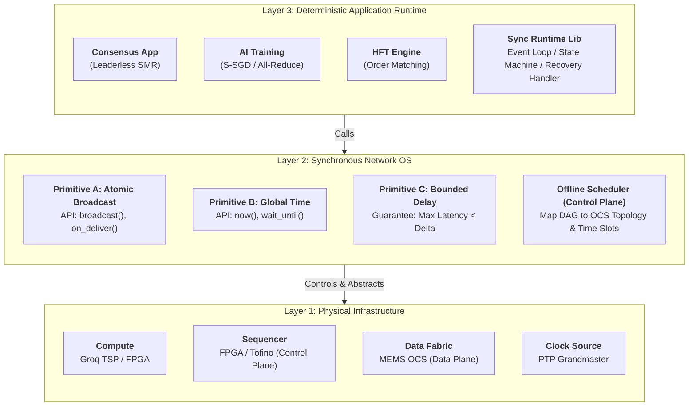
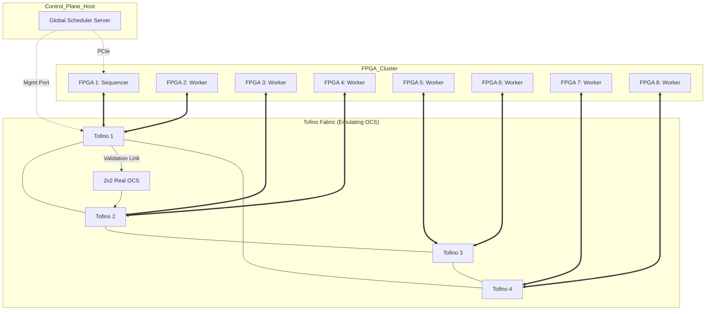

```mermaid
graph TD
    %% =======================
    %% Layer 3: Application Layer
    %% =======================
    subgraph L3 [Layer 3: Deterministic Application Runtime]
        direction TB
        %% 修正点：在 [] 内部的内容外围加上了双引号 "..."
        App1["<b>Consensus App</b><br/>(Leaderless SMR)"]
        App2["<b>AI Training</b><br/>(S-SGD / All-Reduce)"]
        App3["<b>HFT Engine</b><br/>(Order Matching)"]
        
        Runtime["<b>Sync Runtime Lib</b><br/>Event Loop / State Machine / Recovery Handler"]
    end

    %% =======================
    %% Layer 2: Abstraction Layer
    %% =======================
    subgraph L2 [Layer 2: Synchronous Network OS]
        direction TB
        Prim1["<b>Primitive A: Atomic Broadcast</b><br/>API: broadcast(), on_deliver()"]
        Prim2["<b>Primitive B: Global Time</b><br/>API: now(), wait_until()"]
        Prim3["<b>Primitive C: Bounded Delay</b><br/>Guarantee: Max Latency < Delta"]
        
        Scheduler["<b>Offline Scheduler (Control Plane)</b><br/>Map DAG to OCS Topology & Time Slots"]
    end

    %% =======================
    %% Layer 1: Hardware Layer
    %% =======================
    subgraph L1 [Layer 1: Physical Infrastructure]
        direction TB
        HW_Comp["<b>Compute</b><br/>Groq TSP / FPGA"]
        HW_Seq["<b>Sequencer</b><br/>FPGA / Tofino (Control Plane)"]
        HW_Data["<b>Data Fabric</b><br/>MEMS OCS (Data Plane)"]
        HW_Clock["<b>Clock Source</b><br/>PTP Grandmaster"]
    end

    %% Connections
    L3 -->|Calls| L2
    L2 -->|Controls & Abstracts| L1
```

```mermaid
graph TD
    subgraph Control_Plane_Host
        Scheduler["Global Scheduler Server"]
    end

    subgraph Network_Fabric ["Tofino Fabric (Emulating OCS)"]
        T1["Tofino 1"] --- T2["Tofino 2"]
        T2 --- T3["Tofino 3"]
        T3 --- T4["Tofino 4"]
        T4 --- T1
        %% Connect OCS for validation
        T1 -- "Validation Link" --> Real_OCS["2x2 Real OCS"] --> T2
    end

    subgraph FPGA_Cluster
        SEQ["FPGA 1: Sequencer"] <==> T1
        W1["FPGA 2: Worker"] <==> T1
        W2["FPGA 3: Worker"] <==> T2
        W3["FPGA 4: Worker"] <==> T2
        W4["FPGA 5: Worker"] <==> T3
        W5["FPGA 6: Worker"] <==> T3
        W6["FPGA 7: Worker"] <==> T4
        W7["FPGA 8: Worker"] <==> T4
    end

    Scheduler -.->|Mgmt Port| T1
    Scheduler -.->|PCIe| SEQ
```