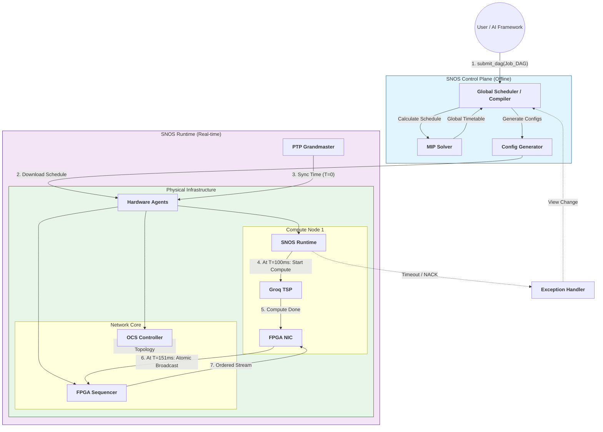

```mermaid
graph TD
    %% =======================
    %% Actors & User Input
    %% =======================
    User((User / AI Framework))
    User -- "1. submit_dag(Job_DAG)" --> Controller

    %% =======================
    %% SNOS Control Plane (Compile Time)
    %% =======================
    subgraph Control_Plane ["SNOS Control Plane (Offline)"]
        direction TB
        Controller[<b>Global Scheduler / Compiler</b>]
        
        Algorithm[<b>MIP Solver</b>]
        Controller -- "Calculate Schedule" --> Algorithm
        Algorithm -- "Global Timetable" --> Controller
        
        Config_Gen[<b>Config Generator</b>]
        Controller -- "Generate Configs" --> Config_Gen
    end

    %% =======================
    %% SNOS Runtime (Run Time)
    %% =======================
    subgraph Runtime_Phase ["SNOS Runtime (Real-time)"]
        direction TB
        
        %% Dispatch
        Config_Gen -- "2. Download Schedule" --> HW_Agents[<b>Hardware Agents</b>]
        
        %% Synchronization
        PTP[<b>PTP Grandmaster</b>] -- "3. Sync Time (T=0)" --> HW_Agents
        
        %% Execution Loop
        subgraph Hardware_Cluster ["Physical Infrastructure"]
            direction LR
            
            subgraph Node_1 ["Compute Node 1"]
                Runtime1[<b>SNOS Runtime</b>]
                Groq1[<b>Groq TSP</b>]
                NIC1[<b>FPGA NIC</b>]
            end
            
            subgraph Network_Core ["Network Core"]
                Seq[<b>FPGA Sequencer</b>]
                OCS[<b>OCS Controller</b>]
            end
            
            %% Configuration Flow
            HW_Agents --> Runtime1
            HW_Agents --> Seq
            HW_Agents --> OCS
            
            %% Execution Flow (Time-Triggered)
            Runtime1 -- "4. At T=100ms: Start Compute" --> Groq1
            OCS -- "4. At T=150ms: Switch Topology" --> Network_Core
            
            %% Data Flow
            Groq1 -- "5. Compute Done" --> NIC1
            NIC1 -- "6. At T=151ms: Atomic Broadcast" --> Seq
            Seq -- "7. Ordered Stream" --> NIC1
        end
    end

    %% =======================
    %% Exception Handling
    %% =======================
    Runtime1 -.->|Timeout / NACK| Exception[<b>Exception Handler</b>]
    Exception -.->|View Change| Controller

    %% Styling
    style Control_Plane fill:#e1f5fe,stroke:#01579b
    style Runtime_Phase fill:#f3e5f5,stroke:#4a148c
    style Hardware_Cluster fill:#e8f5e9,stroke:#1b5e20
```