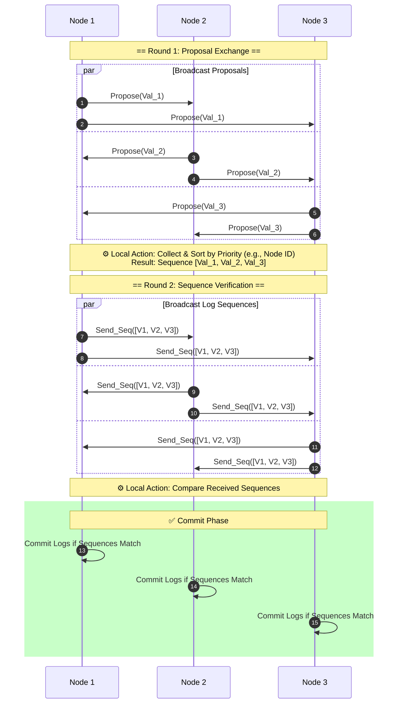

# Synchronous Replication State Machine Simulation

This directory contains a Python-based simulation of a synchronous replication state machine using the Paxos consensus algorithm. The simulation models a network of nodes that communicate with each other to achieve consensus on a series of values, simulating the behavior of a distributed system.

## Synchronous Protocol

The simulation implements a synchronous protocol where messages are guaranteed to be delivered within a known maximum delay. This is crucial for ensuring that all nodes can make progress in the consensus process without indefinite waiting.




## Components

- `main.py`: The main entry point for the simulation. It sets up the simulator, network, and nodes, and runs the simulation.
- `sim_core/`: Contains the core simulation framework, including the `Simulator` and `PaxosNode` classes.
- `SyncNetwork`: A custom network class that simulates synchronous message delivery with a specified maximum delay.
- `sim_conf.toml`: Configuration file for the simulation, specifying parameters such as the number of nodes, round length, and random seed.

## Running the Simulation
To run the simulation, execute the `main.py` script. Ensure that you have Python installed along with any required dependencies.

```bash
python main.py
```
The simulation will initialize the specified number of Paxos nodes, set up the synchronous network, and run for a defined number of rounds. At the end of the simulation, each node will save its state and log the results.
