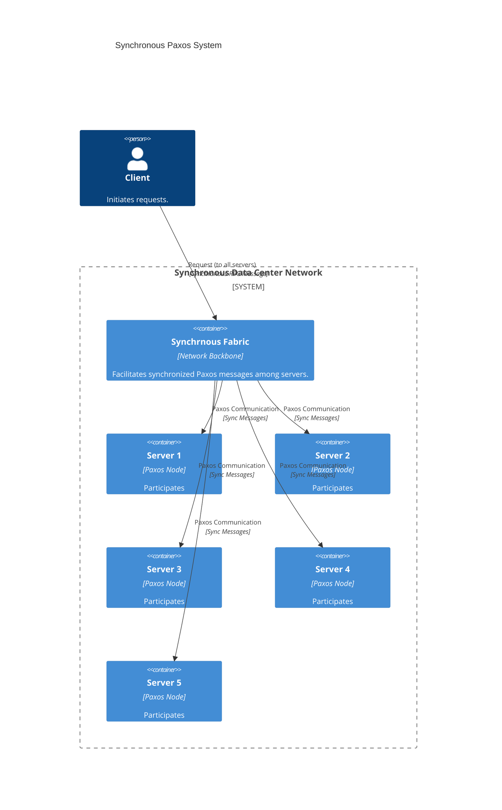

# Synchrnous Paxos

Paxos is a commonly used consensus algorithm in distributed systems. The asynchronous nature of the network makes it difficult to implement a reliable while efficient Paxos implementation. Many works have shown that synchronous Paxos is more efficient than asynchronous Paxos.

This project is a synchronous Paxos implementation that based on a synchornous data center network.

## Network Topology

